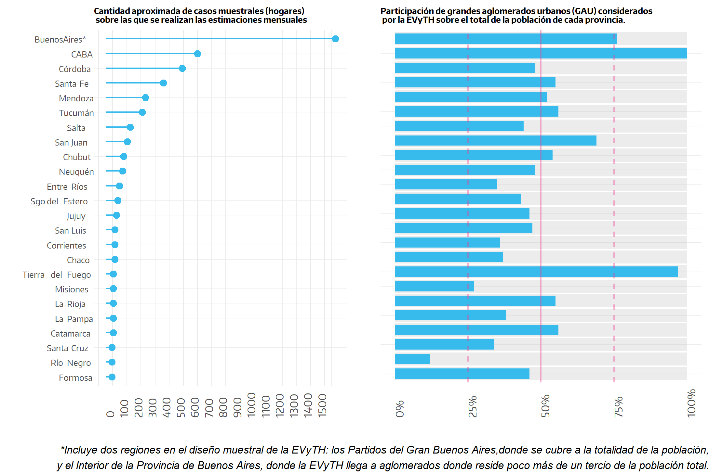
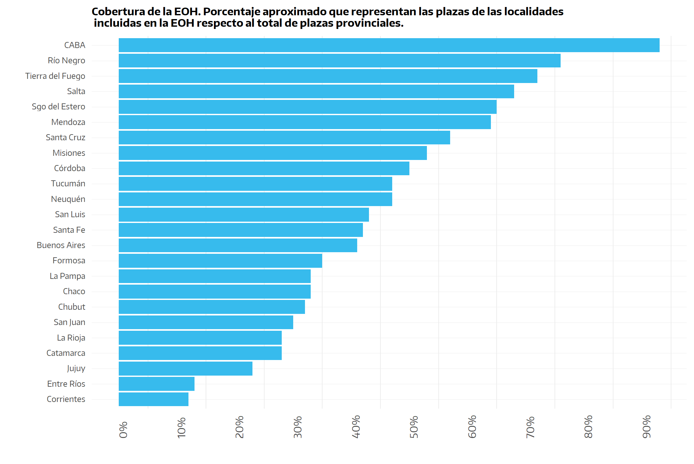
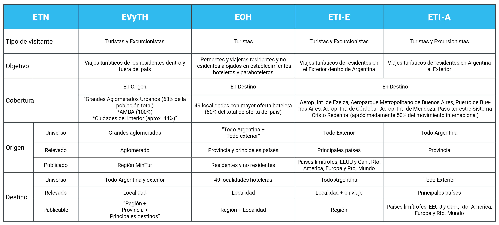
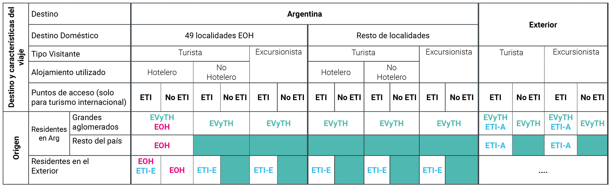

# **Encuestas Nacionales** {#encuestas-nacionales}

**Características y Alcance**

Actualmente, el Ministerio de Turismo y Deportes de la Nación (MINTURDEP) cuenta con tres encuestas que le permiten mensurar y caracterizar el turismo, tanto a nivel nacional como a nivel regional[^encuestas-nacionales-1].Estos estudios son la Encuesta de Viajes y Turismo de los Hogares (**EVyTH**), la Encuesta de Ocupación Hotelera (**EOH**) y la Encuesta de Turismo Internacional (**ETI**).

[^encuestas-nacionales-1]: Las regiones turísticas definidas en sus operativos estadísticos son las siguientes: Ciudad de Buenos Aires, Provincia de Buenos Aires, Córdoba, Litoral (Corrientes, Chaco, Entre Ríos, Formosa, Misiones y Santa Fe), Norte (Catamarca, Jujuy, Salta, Santiago Del Estero, Tucumán y La Rioja), Cuyo (Mendoza, San Juan, San Luis) y Patagonia (Chubut, La Pampa, Neuquén, Río Negro, Santa Cruz y Tierra Del Fuego).

En este capítulo se presentan las principales características metodológicas y las limitaciones que presentan cada una de ellas, tanto en general como para su utilización a niveles provinciales.

No obstante, cabe adelantar aquí que tanto la óptica de análisis como la cobertura de estos operativos difiere.

En cuanto a la óptica, la EVyTH y la ETI son encuestas de demanda, realizadas a los visitantes luego de finalizado su viaje (EVyTH) o al momento de finalización (ETI), mientras que la EOH es una encuesta realizada desde la perspectiva de la oferta, relevada en establecimientos hoteleros y para-hoteleros.

En relación a la cobertura, si bien algunas formas de turismo coinciden, debe tenerse presente que los universos a los que refieren son distintos.
Por ejemplo, el turismo interno (desde la óptica provincial) relevado por la EVyTH contempla los viajes de los residentes en los grandes aglomerados de una provincia a cualquier destino dentro de esa provincia; en cambio, el turismo interno que contempla la EOH cuenta los viajeros que residen en cualquier lugar de la provincia que arriban a las localidades de la provincia incluidas en su muestra.

## EVyTH {#evyth}

La **Encuesta de Viajes y Turismo de los Hogares (EVyTH)** es un operativo realizado por el MINTURDEP, cuyo objetivo principal es proporcionar información sobre los viajes turísticos de los residentes de Argentina hacia dentro y fuera del país: cuándo viajan, a dónde van, qué medios de transporte utilizan, dónde se alojan, cuáles son los motivos por los que viajan, cómo organizan sus viajes, qué actividades turísticas realizan, cuánto gastan, etc.

Se trata de una encuesta realizada en forma telefónica a hogares, en la que se indaga por los viajes realizados por todas las personas que componen el hogar a lugares ubicados fuera de su entorno habitual.
El primer relevamiento se desarrolló durante todo el año 2006; el segundo tuvo lugar durante el primer trimestre de 2011; y finalmente, a partir de enero de 2012, la encuesta se realiza en forma continua.

La muestra abarca a hogares residentes en los "grandes aglomerados urbanos" definidos en la Encuesta Permanente a Hogares del INDEC (63%[^encuestas-nacionales-2] del total de la población argentina, aproximadamente), excluyendo de este modo a los residentes en ciudades medianas y pequeñas, en pueblos y en zonas rurales.

[^encuestas-nacionales-2]: El Área Metropolitana de Buenos Aires (AMBA), conformada por la Ciudad de Buenos Aires y los Partidos del Gran Buenos Aires, tiene una cobertura del 100%, mientras que en el conjunto del Interior del país la cobertura es de aproximadamente el 44%.

Lógicamente, aquellos visitantes residentes en el exterior del país tampoco son alcanzados por este operativo.
Debido a que la encuesta se realiza en el lugar de residencia u origen de los visitantes y dada la cobertura geográfica del operativo, el análisis por origen de los visitantes estará limitado a los visitantes que provienen de los grandes aglomerados urbanos del país.
En cambio, el análisis de los resultados por destino contemplará a todas las ciudades o localidades del país.

La EVyTH indaga por el destino principal del viaje (donde pasó más noches) a nivel de ciudad o localidad.
Si el viaje incluyó alojamiento con pernocte en otras localidades además de la principal, las mismas no son identificadas, aunque sí es posible conocer la cantidad de otras localidades donde se pernoctó.

El diseño muestral de la EVyTH es probabilístico, y se encuadra en un diseño estratificado con selección sistemática al azar dentro de cada uno de los estratos.
Los estratos están conformados por las regiones turísticas utilizadas habitualmente por el MINTURDEP (con la salvedad de que se consideran dos subregiones en el caso de la Provincia de Buenos Aires: los Partidos del Gran Buenos Aires y el Interior de la Provincia de Buenos Aires).

Los resultados de la EVyTH se presentan con períodos de referencia trimestrales.
Los mismos surgen de la agregación de datos calculados a nivel mensual en muestras independientes.
A nivel nacional, las estimaciones mensuales se realizan sobre una muestra de alrededor de 5.200 hogares, integrados por unas 16 mil personas.

Debido a que la encuesta fue diseñada para obtener resultados a niveles regionales, las estimaciones provinciales deben ser consideradas con cautela dado que la cantidad de hogares encuestados en los aglomerados de cada provincia varía sustancialmente.
Llógicamente, a mayor cantidad de muestra, las estimaciones presentarán mayor fiabilidad (menor error estadístico, véase Figura 2.1).

**Figura 2.1. Cantidad aproximada de casos muestrales (hogares) sobre las que se realizan las estimaciones mensuales y participación de él o los grandes aglomerados urbanos (GAU) considerados por la EVyTH sobre el total de la población de cada provincia.**

```{r cantidades, echo=FALSE, fig.cap="Cantidad y participación" }

```

::: {.note}
Para más información de la EVyTH podes consultar los informes técnicos de resultados y las series estadísticas en:

[Data abierta](http://datos.yvera.gob.ar/dataset/encuesta-viajes-turismo-hogares-evyth){target="_blank"}

[Informes técnicos](https://www.yvera.tur.ar/estadistica/info/encuesta-de-viajes-y-turismo-de-los-hogares-evyth){target="_blank"}

[Encuesta Permanente a Hogares del INDEC](https://www.indec.gob.ar/indec/web/Institucional-Indec-OperacionesEstadisticas){target="_blank"}
:::

## EOH {#eoh}

La **Encuesta de Ocupación Hotelera (EOH)** es un relevamiento realizado en forma continua desde el 2004, bajo la coordinación del MINTURDEP y el [Instituto Nacional de Estadísticas y Censos (INDEC)](https://www.indec.gob.ar/indec/web/Nivel4-Tema-3-13-56){target="_blank"}, que tiene como objetivo medir el impacto del turismo interno e internacional sobre la actividad de los establecimientos hoteleros y para-hoteleros.
Con periodicidad mensual, mide, entre otras variables, la cantidad de pernoctes, de viajeros residentes y no residentes, la estadía promedio por viajero y la tasa de ocupación en plazas y habitaciones.
Además, permite distinguir la información de acuerdo al origen de los viajeros (provincia o país de residencia).

Este operativo releva 49 de las localidades con mayor oferta hotelera y para-hotelera del país, dentro de las siete regiones turísticas definidas por el MINTURDEP.
Por tanto, su cobertura respecto a la contabilización del turismo se debe considerar desde el punto de vista del destino del viaje (independientemente del origen o lugar de residencia del viajero).

Cabe señalar que, como muestra la Figura \@ref(fig:cobertura), el peso de las localidades incluidas en este estudio sobre el total del sector hotelero y parahotelero de cada provincia muestra importantes diferencias entre las mismas.

**Figura 2.2. Cobertura de la EOH. Porcentaje aproximado que representan las plazas de las localidades incluidas en la EOH respecto al total de plazas hoteleras y parahoteleas provinciales. Datos a diciembre de 2019.**

```{r cobertura, echo=FALSE, fig.cap="cobertura de la EOH" }

```

Los tipos de establecimientos incluidos en la muestra son, dentro de los hoteleros, los hoteles de 1 a 5 estrellas y los apart-hoteles; y, dentro de los para-hoteleros, los hoteles sindicales, albergues, cabañas, bungalows, hospedajes, bed & breakfast, hosterías, etc.
Cabe señalar que la EOH excluye de su universo a los establecimientos pequeños (menos de 4 habitaciones o de 12 plazas inclusive).

Todos los viajeros que se alojen en estos tipos de establecimientos dentro de las localidades consideradas, serán relevados por la encuesta.

Sin embargo, además de las localidades no incluidas en el diseño muestral de la encuesta, cabe recordar que, aún en las localidades consideradas, quedan por fuera del operativo las viviendas de alquiler temporario y los campings, así como también las segundas viviendas y las viviendas de familiares y amigos, y otros lugares de alojamiento de menor relevancia.
Por otro lado, considera solamente a las personas que pernoctaron en el destino, dejando fuera a los excursionistas.

Asimismo, al analizar viajeros hospedados (o huéspedes), a partir de la informacion brindada por los hoteleros, no es posible que se distingua, dado la dificultad de su clasificación, entre los visitantes y los otros viajeros alojados en los establecimientos.

::: {.note}
Para más información de los informes de resultados, series estadísticas y la metodología, vistá:

[Informes de prensa en Yvera](https://www.yvera.tur.ar/estadistica/info/encuesta-de-ocupacion-hotelera-eoh){target="_blank"}

[Data Abierta](http://datos.yvera.tur.ar/dataset/encuesta-ocupacion-hotelera-parahotelera-eoh){target="_blank"}

[Doc metodológico (INDEC)](https://www.indec.gob.ar/ftp/cuadros/economia/eoh_aspectos_metodologicos.pdf){target="_blank"} 
:::

## ETI {#eti}

La **Encuesta de Turismo Internacional (ETI)** es otro operativo realizado en forma continua desde el año 2004, coordinado conjuntamente por el MINTURDEP y el [INDEC](https://www.indec.gob.ar/indec/web/Nivel4-Tema-3-13-55){target="_blank"}.

Tiene por objetivo general conocer las características de los viajes (el motivo, la duración, el/los destino/s, el/los tipos de alojamientos utilizados, etc.), y de los viajeros (lugar de residencia, conformación del grupo viajero, etc.), así como los gastos en alojamiento, alimentación, traslados, transportes y compras que realizan los viajeros en los lugares visitados.

Releva a los viajeros no residentes en la Argentina que visitaron el país (al salir del país) y a los viajeros residentes en Argentina que viajan al exterior (al volver al país).

Cubre el movimiento internacional de seis puntos de entrada y salida del país: Aeropuerto de Ezeiza, Aeroparque Jorge Newbery, Aeropuerto de Córdoba (Pajas Blancas), Aeropuerto de Mendoza (El Plumerillo), Puerto de Buenos Aires y el paso fronterizo terrestre Sistema Cristo Redentor, que representan aproximadamente la mitad del flujo internacional de viajeros, dejando fuera de análisis los ingresos y egresos por otros puntos de frontera.
En este sentido, es preciso tener en cuenta que el comportamiento y las características de los viajes de quienes ingresan o egresan por los puntos de acceso cubiertos por la encuesta, es diferente al de los viajeros que lo hacen por otros puntos.

A partir del año 2019 la pregunta de los destinos visitados (itinerario) en Argentina es de tipo abierta y se registra todos aquellos lugares donde el turista realiza al menos una pernoctación junto con el tipo de alojamiento utilizado.
Hasta el año 2018 la encuesta contemplaba 13 destinos principales (localidad o zona o provincia, según el caso) y una categoría que engloba a todos los destinos regionales no contemplados entre los anteriores.
Por esta razón, los datos históricos, en la mayoría de los casos, no se encuentran disponibles con apertura provincial.

::: {.note}
Para más información de los informes de resultados, series estadísticas y la metodología, vistá:

Informes de prensa en [Yvera](https://www.yvera.tur.ar/estadistica/info/turismo-internacional){target="_blank"}

[Doc metodológico](https://www.yvera.tur.ar/estadistica/documentos/descarga/5d5c00efe6866641938689.pdf){target="_blank"}

[ETI - INDEC](https://www.indec.gob.ar/indec/web/Nivel4-Tema-3-13-55){target="_blank"}

:::


## Síntesis

**Principales características y cobertura de las Encuestas Nacionales de Turismo**

La Figura \@ref(fig:ent) presenta en forma comparativa las principales características de cada una de las tres Encuestas Nacionales de Turismo (ENT) que releva el MINTURDEP.

```{r ent, echo=FALSE, fig.cap="Principales características de las Encuestas Nacionales de Turismo (ENT)" }

```

Asimismo, la Figura \@ref(fig:coberturaENT) da cuenta de cuáles son los segmentos de visitantes de los que se puede dar cuenta "teóricamente" (sin entrar en el análisis de la robustez de las estimaciones, más aún considerando niveles provinciales) a partir de estos estudios.
Como puede observarse, hay una importante cantidad de segmentos (sombreados en rojo) para los que ninguna fuente actualmente puede brindar información.

```{r coberturaENT, echo=FALSE, fig.cap="Cobertura teórica por parte de las ENT de los visitantes según origen y destino."}

```

::: {.note}
Para ver un ejemplo de cómo el MINTURDEP utiliza los datos de estas encuestas para obtener resultados a nivel de provincia se pueden visitar las fichas de [Estadísticas de turismo por provincia](https://www.yvera.tur.ar/estadistica/info/estadisticas-de-turismo-por-provincias){target="_blank"}.

:::